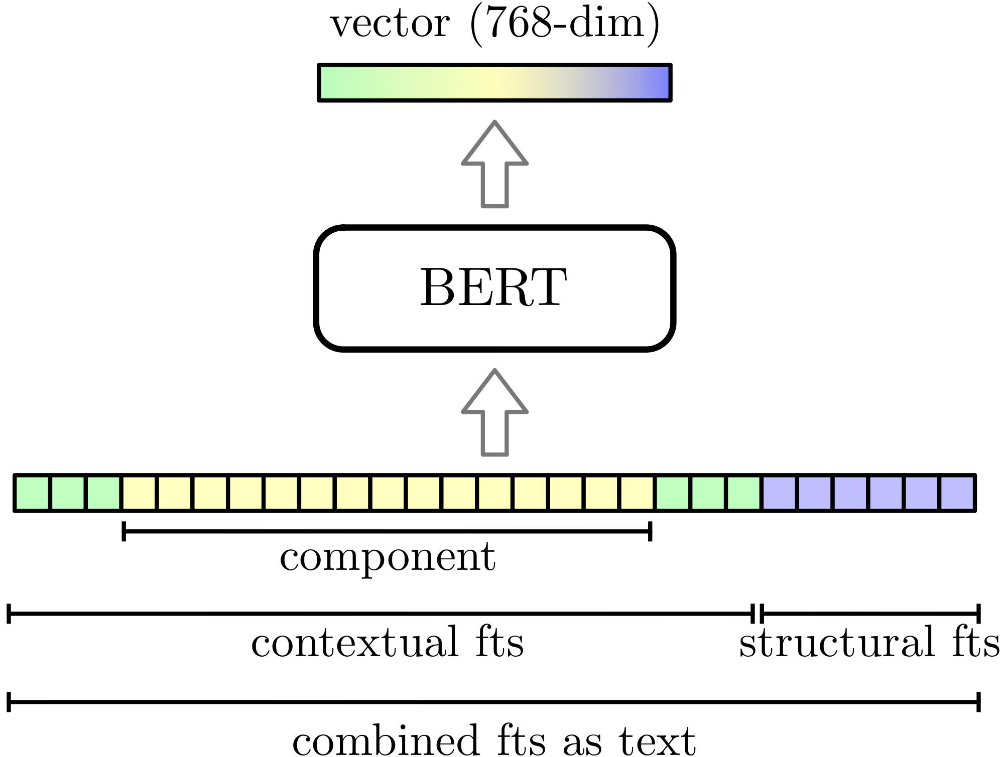

# Argument Classification with BERT plus Contextual and Structural Features as Text

**Abstract:** In Argument Mining (AM), the integral sub-task of argument
component classification refers to the classification of argument
components as claims or premises. In this context, the content of the component
alone does not actually suffice to predict it’s corresponding class
accurately. In fact, additional lexical, contextual, and structural features
are needed. Here, we propose a unified model for argument component
classification based on BERT. Our model incorporates the component
itself together with contextual and structural features – given as text –
instead of the usual numerical form. This new technique enables BERT
to build a customized and enriched representation of the component. We
evaluate our model on three datasets that reflect a diversity of written
and spoken discourses. We achieve state-of-art results on two datasets
and 95% of the best results on the third. Our approach shows that BERT
is capable of exploiting non-textual information given in a textual form.
To the best of our knowledge, our work is the first to investigate and
implement a features as text, BERT-based model for text classification.

# Model

Our model incorporates contextual and structural features of the argument component to build enriched BERT based representation for argument classification. More details about BERT and other transformer models can be found here: https://github.com/huggingface/transformers

<p align="center">

</p>

# Data

We experiment on our model with 3 datasets: 

1) *Persuasive Essays*: https://tudatalib.ulb.tu-darmstadt.de/handle/tudatalib/2422
2) *Yes We Can*: https://github.com/ElecDeb60To16/Dataset
3) *Change My View*: https://github.com/chridey/change-my-view-modes

The contextual and structural features of all three datasets have been pre-computed separately. All three datasets in the PyTorch ready ``.pt`` format are given in the ``/datasets`` folder.

# Tasks

We train our model for two tasks: 

1) BERT fine-tune on the three datasets
2) comparing numerical concatenation versus our structural features as text

More details about BERT fine-tuning can be found here: https://huggingface.co/docs/transformers/training

# Notebooks

The notebooks used for the experiments are given in the ``/notebooks`` folder. More detailed explanation about the usage is provided in the ``README`` file in the folder.

# Requirements

We use the following versions of the packages:

```
torch==1.10
transformers==4.12.5
datasets==1.15.1
tensorboard==2.6.0
```

# Platform

All experiments have been performed on Paperspace's Gradient cloud AI/ML platform: https://gradient.run/
